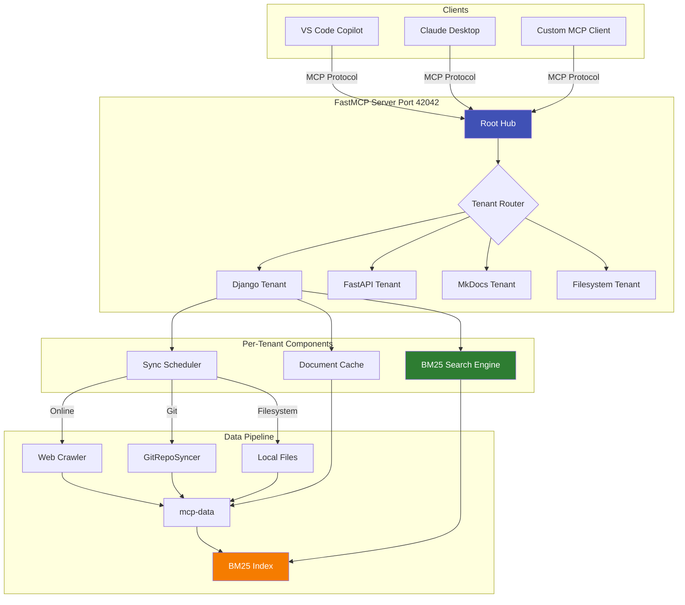
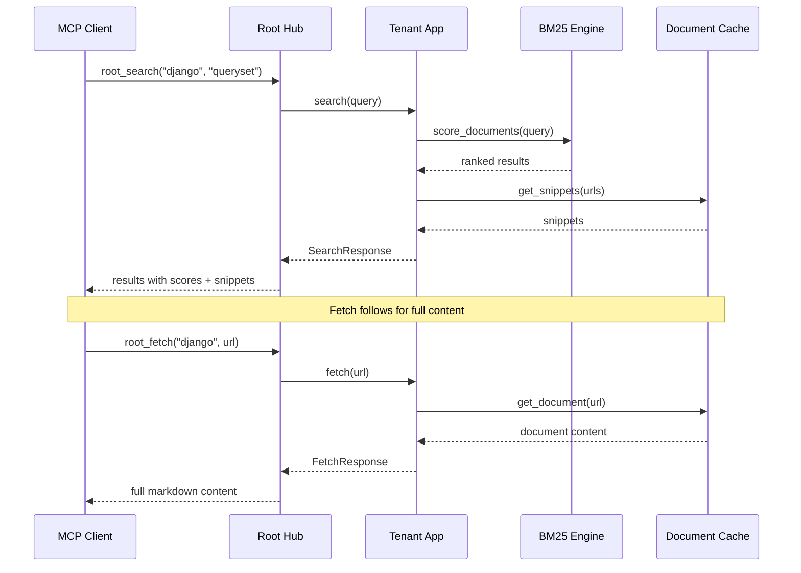

# Explanation: Architecture

**Audience**: Engineers integrating or extending docs-mcp-server.  
**Prerequisites**: Familiar with Python async, Docker, and MCP.  
**What you'll learn**: How tenants, sync, search, and MCP tools fit together; trade-offs and alternatives.

---

## The Problem

Teams juggle many documentation sources:

- **Websites** with rendered HTML (Django docs, FastAPI docs)
- **Git repositories** with markdown files (project READMEs, internal docs)
- **Local files** already on disk (your own markdown docs)

AI assistants need **one interface** to search all of them with consistent ranking and fresh content. Without this, developers manually search multiple sources or AI assistants hallucinate without access to authoritative documentation.

---

## System Architecture



---

## Our Approach

### Multi-Tenant FastMCP
Each tenant exposes MCP tools (`root_search`, `root_fetch`, `root_browse`) behind one HTTP endpoint. The `RootHub` routes requests to the appropriate tenant based on the `tenant_codename` parameter.

### BM25 Search
Documents are indexed with BM25 + IDF floor to keep scores **always positive** across small and large corpora. This avoids the negative score problem that plagues TF-IDF on small document collections.

### Three Sync Paths
- **Online tenants** use web crawlers + article-extractor for clean content extraction
- **Git tenants** use `GitRepoSyncer` with sparse checkout for efficient repo sync
- **Filesystem tenants** read local markdown files directly

All paths feed into the same search segment format, enabling uniform BM25 indexing.

### Snippet + Fetch
Search returns scored hits with **contextual snippets**. The `fetch` tool retrieves full document content from cache—either the complete document or just the surrounding context.

---

## Data Flow



**Step-by-step**:

1. **Sync**: `trigger_all_syncs.py` crawls websites or git-pulls repos into `mcp-data/<tenant>/`
2. **Index**: `trigger_all_indexing.py` builds BM25 segments under `__search_segments/`
3. **Serve**: FastMCP reads segments; MCP tools answer `search` and `fetch` requests
4. **Query**: VS Code/Claude call MCP endpoint at `http://127.0.0.1:42042/mcp`

---

## Trade-offs

### Single BM25 Tuning
One set of parameters for all tenants (no per-tenant tuning) keeps configuration simple. We rely on IDF floor and length normalization for stability across different corpus sizes.

### Crawl vs Git
Git tenants are **faster** and **deterministic**—you get exactly what's in the repo. Online tenants offer **freshness** but depend on robots.txt compliance and HTML stability. Choose based on your documentation source.

### No Search Result Caching
Queries vary widely; caching is low-yield and can hide freshness issues. We cache **documents**, not search results.

---

## Alternatives Considered

| Approach | Pros | Cons | Why Not Chosen |
|----------|------|------|----------------|
| **TF-IDF only** | Simple, fast | Negative scores on small corpora, weaker relevance | BM25 with IDF floor performs better on docs |
| **Per-tenant ranking params** | Tunable per corpus | Complexity in config, harder ops | Prefer smart defaults and code-side fixes |
| **Heavy vector search** | Great semantic recall | Higher infra cost, slower cold starts | BM25 is sufficient for structured docs |
| **Single-tenant mode** | Simpler code | One container per doc source | Multi-tenant is more efficient for many sources |

---

## Key Design Decisions

### Why FastMCP?
FastMCP provides a simple decorator-based API for MCP tools, handles HTTP transport, and integrates well with Python async. It's maintained by the MCP community and provides all the primitives we need.

### Why BM25 over Vector Search?
Documentation is **structured text** with clear keywords. BM25 excels at keyword matching and is:
- Faster to index (no embedding models)
- Faster to query (no vector similarity)
- Easier to explain (term frequency × inverse document frequency)
- Sufficient for "find docs about X" queries

Vector search adds value for semantic similarity ("find docs similar to this one"), but that's not our primary use case.

### Why Separate Sync and Index?
Separating concerns allows:
- **Incremental syncs** without full re-indexing
- **Parallel sync** of multiple tenants
- **Index rebuild** without re-downloading content
- **Easier debugging** (is it a sync problem or index problem?)

---

## Verification Hooks

You can verify the architecture works correctly with these commands:

```bash
# Test sync path
uv run python trigger_all_syncs.py --tenants drf --force

# Test index path
uv run python trigger_all_indexing.py --tenants drf

# Test search and fetch via debug script
uv run python debug_multi_tenant.py --host localhost --port 42042 --tenant drf --test all

# Check container health
curl -s http://localhost:42042/health | jq '{status, tenant_count}'
```

Run `uv run mkdocs build --strict` to verify documentation stays in sync with code.

---

## Related

- [Search Ranking (BM25)](search-ranking.md) — Deep dive into BM25 scoring
- [Sync Strategies](sync-strategies.md) — When to use online, git, or filesystem
- [Cosmic Python Patterns](cosmic-python.md) — Repository and Unit of Work patterns

**Test coverage**: See `tests/unit/test_bm25_engine.py` and `tests/unit/tools/test_cleanup_segments.py` for behavior-focused tests.

