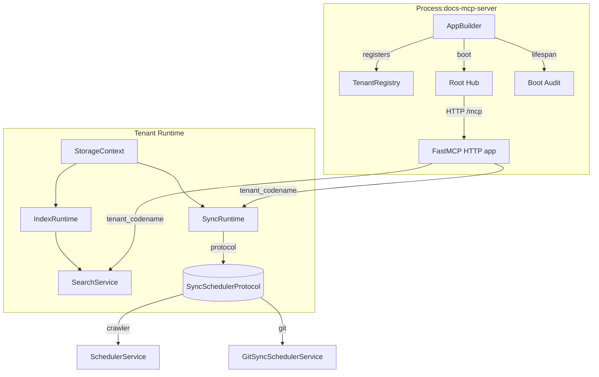
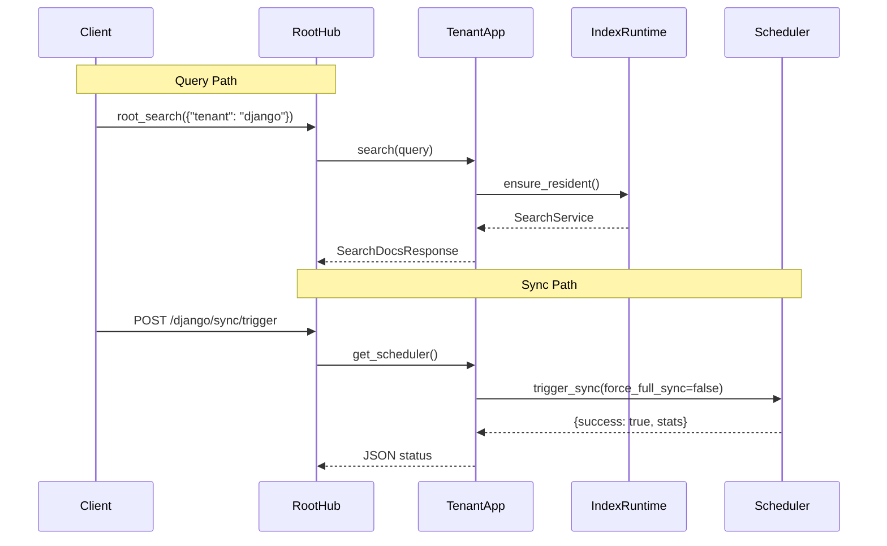

# Explanation: Architecture

**Audience**: Engineers integrating or extending docs-mcp-server.  
**Prerequisites**: Comfortable with Python async, Docker, uv, and MCP concepts.  
**What you'll learn**: How AppBuilder, tenant runtimes, schedulers, and search cooperate; why we chose this design; how to verify it in your environment.

---

## The Problem

Documentation lives everywhere — rendered HTML sites, Git repositories, and local markdown folders. Every source exposes different navigation, authentication, and freshness guarantees. Without a shared interface, AI assistants either miss context or hallucinate answers while engineers alt-tab between tabs.

docs-mcp-server solves this by presenting **one MCP endpoint** that fans out to many documentation tenants, each with identical tooling (`root_search`, `root_fetch`, `root_browse`). The hard part is keeping these tenants isolated yet cheap to operate.

---

## Design Objectives

- **Single surface, many tenants**: Run one FastMCP server on port 42042 that multiplexes traffic using tenant codenames.
- **Deterministic sync**: Every tenant emits identical search segments regardless of whether content comes from a crawler, Git, or the local filesystem.
- **Deep modules**: Keep orchestration inside `AppBuilder` and encapsulate tenant knowledge inside `StorageContext`, `IndexRuntime`, and `SyncRuntime`.
- **Fail-fast health**: Health endpoints and signal handlers live beside the builder so operators always know when residency or schedulers misbehave.

---

## High-Level Topology



`AppBuilder` loads `deployment.json` (or DOCS_* env vars), constructs every `TenantApp`, and mounts a single FastMCP HTTP surface. Background responsibilities sit in `runtime/` helpers:

- `runtime.health.build_health_endpoint()` aggregates tenant health plus boot audits.
- `runtime.signals.install_shutdown_signals()` publishes a shared `shutdown_event` used by the lifespan manager to drain residency cleanly.

---

## Runtime Layers

### 1. AppBuilder + Root Hub

- **Config loading**: `AppBuilder` prefers disk configs but can synthesize a single-tenant config from `DOCS_NAME` and related env vars for quick demos.
- **Tenant registration**: Each `TenantApp` registers with `TenantRegistry`, giving the `RootHub` a constant-time lookup table for incoming MCP calls.
- **Routes**: `/mcp` serves MCP traffic, `/health` reports residency + boot audit, and `/{tenant}/sync/*` exposes scheduler introspection guarded by operation mode.
- **Lifespan**: All tenant initializations happen during Starlette startup via a shared async lifespan manager. Shutdown signals flip an event that drains tenants before exiting.

### 2. Tenant Composition

Every tenant is built from three focused contexts:

1. **StorageContext** normalizes directory structure (`mcp-data/<tenant>`), cleans orphaned staging dirs, and hands out `FileSystemUnitOfWork` instances.
2. **IndexRuntime** ensures BM25 search segments exist and stay resident. It can trigger background refreshes and exposes `SearchService` handles to the MCP layer.
3. **SyncRuntime** wires schedulers through `SyncSchedulerProtocol`. Online tenants receive `SchedulerService` (crawler + sitemap aware). Git tenants use `GitSyncSchedulerService`, which wraps `GitRepoSyncer` and metadata stores.

These contexts give us **deep modules**: each encapsulates all invariants for its concern, so changing crawler strategy never leaks into fetch or search code.

### 3. Search Path

Search remains BM25-based with an IDF floor ($\text{idf} = \max(0, \log\frac{N - df + 0.5}{df + 0.5} + 1)$) so all scores stay non-negative across tiny corpora. `JsonSegmentStore` caps the number of resident shards per tenant to keep memory predictable. Snippets are generated on-demand rather than cached, ensuring we always show the latest content after a sync.

### 4. Sync Path

All schedulers honor the `SyncSchedulerProtocol` surface:

- `initialize()` bootstraps metadata and can kick off an initial crawl or git export.
- `trigger_sync()` accepts `force_crawler` and `force_full_sync` flags (ignored by git schedulers) and returns structured status.
- `stats` reports refresh intervals, last commit IDs, and failure counters that feed `/sync/status`.

Because HTTP never branches on the tenant type, adding a new scheduler flavor means implementing the protocol and passing it through `SyncRuntime`—no new routes required.

---

## Execution Flow



**Operator workflow**:

1. `trigger_all_syncs.py` (or the HTTP endpoint) populates storage via crawler, git, or filesystem copies.
2. `trigger_all_indexing.py` rebuilds BM25 shards in-place with the same code the HTTP server will load.
3. `debug_multi_tenant.py --test search` exercises tenant search, fetch, and browse to catch regressions before deployment.

---

## Trade-offs and Failure Containment

- **Single BM25 configuration** keeps `deployment.json` lean. If a tenant needs a tweak, we fix it in the scorer instead of inventing per-tenant knobs.
- **No search-result cache**: The snippet fetch step already hits the storage cache; caching query responses would hide sync freshness issues and inflate RAM.
- **Git vs crawler**: Git syncs are deterministic and cheap but require repo access. Crawlers reach public docs without repo access, but depend on HTML stability and robots.txt. Both share `SyncMetadataStore`, so status endpoints look identical.

---

## Alternatives Considered

| Approach | Pros | Cons | Why Not Chosen |
|----------|------|------|----------------|
| Per-tenant FastMCP instances | Total isolation per port | Hundreds of endpoints, wasteful memory, duplicated schedulers | AppBuilder + RootHub give isolation with one server |
| TF-IDF only | Easy math, tiny indexes | Negative scores on small corpora, poor length normalization | BM25 + IDF floor is stable across 7–2500 docs |
| Vector search everywhere | Semantic recall, fuzzy matching | Requires embeddings, GPU/ANN infra, slower cold starts | Doc queries are keyword heavy; BM25 already answers them |
| Configurable scheduler flavors per tenant | Flexible toggles | Leads to boolean webs and leaking infra knowledge | `SyncSchedulerProtocol` keeps complexity inside schedulers |

---

## Verification Hooks

Run these after wiring a new tenant or touching runtime code:

```bash
uv run ruff format . && uv run ruff check --fix .
timeout 120 uv run pytest -m unit
uv run python debug_multi_tenant.py --tenant drf --test search
uv run python trigger_all_syncs.py --tenants aidlc-rules --force
uv run python trigger_all_indexing.py --tenants drf django
curl -s http://localhost:42042/health | jq '{status, tenant_count}'
```

- Need a step-by-step recipe? See [How-To: Configure Online Tenant](../how-to/configure-online-tenant.md) and [How-To: Configure Git Tenant](../how-to/configure-git-tenant.md).
- Looking for schema details? Reference [deployment.json Schema](../reference/deployment-json-schema.md) and [MCP Tools](../reference/mcp-tools.md).

---

## Related

- [Search Ranking (BM25)](search-ranking.md) — Deeper dive into scoring heuristics.
- [Sync Strategies](sync-strategies.md) — Trade-offs between crawler, git, and filesystem inputs.
- [Cosmic Python Patterns](cosmic-python.md) — How our service layer follows Repository + Unit of Work patterns.

**Test coverage**: Scheduler surfaces live in `tests/unit/test_app_unit.py`, `tests/unit/test_git_sync_scheduler_service_unit.py`, and `tests/test_scheduler_service.py`.
