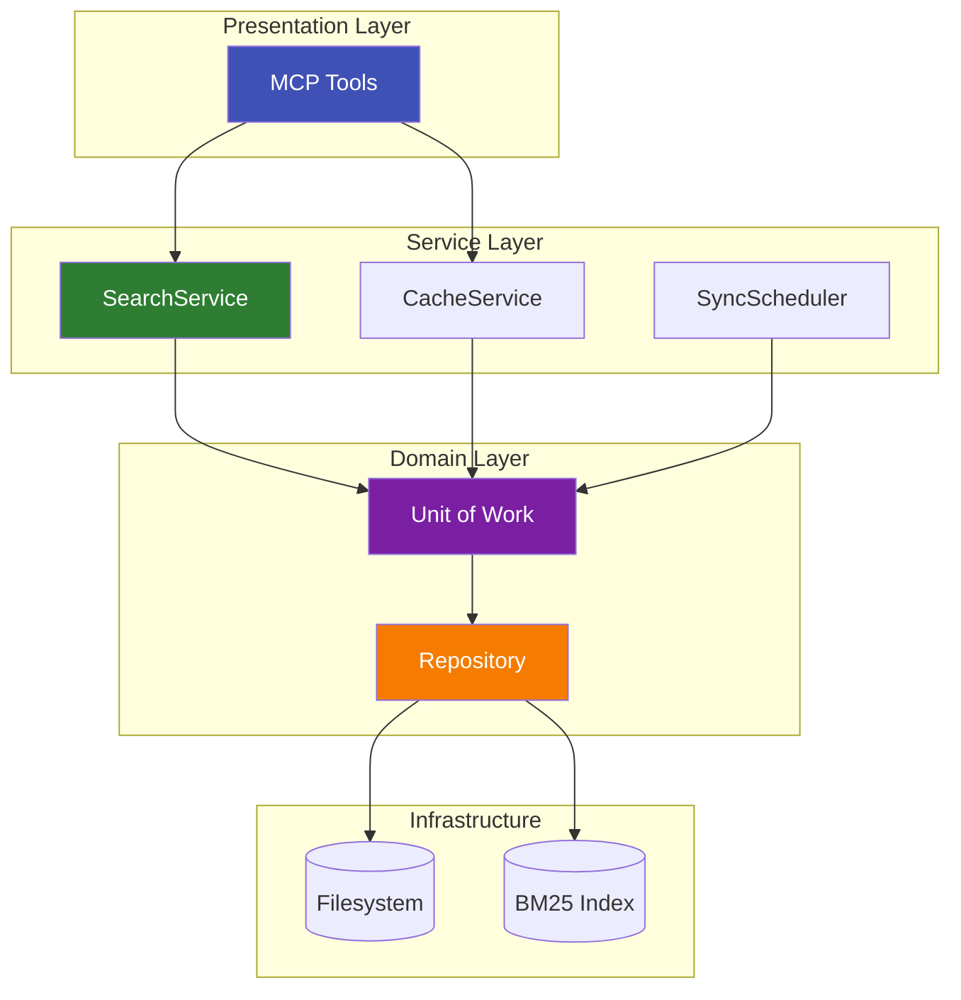

# Explanation: Cosmic Python Patterns

## The Problem

Documentation MCP servers need to:
- Read/write documents to storage (filesystem, cache)
- Perform complex search operations
- Handle multiple tenants with isolation
- Remain testable without real filesystems

Without architectural patterns, this leads to:
- Business logic scattered across files
- Tight coupling to filesystem operations
- Difficult-to-test code requiring real I/O
- Spaghetti dependencies between components

---

## Our Approach: Cosmic Python Patterns

We follow patterns from [Cosmic Python](https://www.cosmicpython.com/), a free online book about Python architecture:



The three key patterns:

1. **Repository Pattern**: Abstract data access
2. **Unit of Work**: Manage transactions/sessions
3. **Service Layer**: Orchestrate business logic

---

## Repository Pattern

**Problem**: Business logic directly calls filesystem operations, making it hard to test and change storage backends.

**Solution**: Define an abstract interface for data access.

### Before (Coupled)

```python
# Business logic mixed with filesystem operations
async def search_documents(query: str) -> list:
    docs = []
    for path in Path("mcp-data").glob("**/*.md"):
        content = path.read_text()
        if query in content:
            docs.append(content)
    return docs
```

### After (Repository Pattern)

```python
# Abstract repository interface
class DocumentRepository(Protocol):
    async def get(self, url: str) -> Document | None: ...
    async def add(self, doc: Document) -> None: ...
    async def list_all(self) -> list[Document]: ...

# Concrete implementation
class FilesystemDocumentRepository:
    def __init__(self, root_dir: Path):
        self.root_dir = root_dir
    
    async def get(self, url: str) -> Document | None:
        path = self._url_to_path(url)
        if path.exists():
            return Document(url=url, content=path.read_text())
        return None

# Business logic uses abstraction
async def search_documents(repo: DocumentRepository, query: str) -> list:
    docs = await repo.list_all()
    return [d for d in docs if query in d.content]
```

!!! success "Repository Pattern Benefits"
    - **Testable**: Pass `FakeDocumentRepository` in tests
    - **Swappable**: Change to S3, database, etc. without touching business logic
    - **Clear boundaries**: Storage concerns isolated from domain logic

---

## Unit of Work Pattern

**Problem**: Operations spanning multiple repositories need coordination (atomic commits, rollback on error).

**Solution**: Wrap repository access in a context manager that handles transactions.

### Implementation

```python
class FilesystemUnitOfWork:
    def __init__(self, root_dir: Path):
        self.root_dir = root_dir
        self._documents: DocumentRepository | None = None
    
    async def __aenter__(self):
        self._documents = FilesystemDocumentRepository(self.root_dir)
        return self
    
    async def __aexit__(self, exc_type, exc_val, exc_tb):
        if exc_type:
            # Handle error (logging, cleanup)
            pass
        # Finalize any pending operations
    
    @property
    def documents(self) -> DocumentRepository:
        if self._documents is None:
            raise RuntimeError("UoW not entered")
        return self._documents
    
    async def commit(self):
        # Persist any pending changes
        pass
```

### Usage

```python
async with FilesystemUnitOfWork(root_dir) as uow:
    doc = await uow.documents.get(url)
    doc.content = updated_content
    await uow.documents.add(doc)
    await uow.commit()
```

### Benefits

- **Atomic operations**: All-or-nothing semantics
- **Resource management**: Proper cleanup via context manager
- **Explicit boundaries**: Clear start/end of work unit

---

## Service Layer

**Problem**: Business logic scattered across API handlers, making it hard to reuse and test.

**Solution**: Create dedicated service classes that orchestrate use cases.

### Implementation

```python
class SearchService:
    def __init__(self, uow_factory: Callable[[], UnitOfWork], index_path: Path):
        self._uow_factory = uow_factory
        self._engine = BM25Engine(index_path)
    
    async def search(self, query: str, size: int = 10) -> SearchDocsResponse:
        # Orchestrate the search operation
        async with self._uow_factory() as uow:
            results = self._engine.search(query, size)
            # Enrich with full documents if needed
            enriched = []
            for r in results:
                doc = await uow.documents.get(r.url)
                enriched.append(SearchResult(
                    url=r.url,
                    title=doc.title if doc else r.title,
                    score=r.score,
                    snippet=r.snippet
                ))
            return SearchDocsResponse(query=query, results=enriched)
```

!!! success "Service Layer Benefits"
    - **Reusable**: Same service works for API, CLI, tests
    - **Testable**: Inject fake UoW, mock engine
    - **Clear API**: Well-defined service methods

---

## How It Fits Together

```
┌─────────────────────────────────────────────────────────┐
│                      API Layer                          │
│           (FastMCP tools, HTTP endpoints)               │
└────────────────────────┬────────────────────────────────┘
                         │
┌────────────────────────▼────────────────────────────────┐
│                   Service Layer                         │
│         (SearchService, CacheService, etc.)            │
└────────────────────────┬────────────────────────────────┘
                         │
┌────────────────────────▼────────────────────────────────┐
│                  Unit of Work                           │
│          (FilesystemUnitOfWork, transaction)            │
└────────────────────────┬────────────────────────────────┘
                         │
┌────────────────────────▼────────────────────────────────┐
│                  Repositories                           │
│      (DocumentRepository, IndexRepository, etc.)        │
└────────────────────────┬────────────────────────────────┘
                         │
┌────────────────────────▼────────────────────────────────┐
│                    Infrastructure                       │
│           (Filesystem, BM25 Engine, HTTP)               │
└─────────────────────────────────────────────────────────┘
```

---

## Testing with Fakes

The patterns enable testing without real I/O:

```python
class FakeUnitOfWork:
    _shared_store: dict = {}  # Class-level storage for test isolation
    
    def __init__(self):
        self._documents = FakeDocumentRepository(self._shared_store)
    
    async def __aenter__(self):
        return self
    
    async def __aexit__(self, *args):
        pass
    
    @property
    def documents(self):
        return self._documents
    
    async def commit(self):
        pass  # In-memory, no persistence needed
    
    @classmethod
    def clear_shared_store(cls):
        cls._shared_store.clear()


# Test example
@pytest.fixture(autouse=True)
def clean_store():
    FakeUnitOfWork.clear_shared_store()
    yield
    FakeUnitOfWork.clear_shared_store()

async def test_search_returns_results():
    uow = FakeUnitOfWork()
    # Populate fake data
    async with uow:
        await uow.documents.add(Document(url="http://example.com", content="test"))
    
    service = SearchService(lambda: FakeUnitOfWork(), index_path=None)
    results = await service.search("test")
    assert len(results.results) > 0
```

---

## Alternatives Considered

| Pattern | Pros | Cons | Decision |
|---------|------|------|----------|
| No patterns (direct I/O) | Simple, fast to write | Untestable, coupled | Rejected |
| Active Record | Simpler API | Tight coupling | Rejected |
| Full DDD with aggregates | Maximum flexibility | Over-engineering for docs | Rejected |
| **Repository + UoW + Service** | Testable, clear boundaries | Some boilerplate | **Chosen** |

---

## Further Reading

- [Cosmic Python Book](https://www.cosmicpython.com/book/preface.html) — Free online book
- [Repository Pattern](https://www.cosmicpython.com/book/chapter_02_repository.html) — Chapter 2
- [Unit of Work](https://www.cosmicpython.com/book/chapter_06_uow.html) — Chapter 6
- Reference: [Python API](../reference/python-api.md) — Internal module structure

