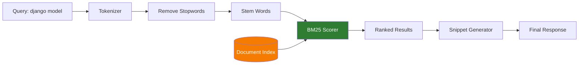

# Explanation: Search Ranking (BM25)

**Audience**: Developers tuning search quality or understanding how results are ranked.  
**Prerequisites**: Basic familiarity with search concepts (optional).  
**What you'll learn**: Why we use BM25 with IDF floor, how the pipeline works, and when to re-index.

---

## The Problem

Documentation search must answer: "Which documents are most relevant to this query?"

**Why simple approaches fail:**

| Approach | Problem | Impact |
|----------|---------|--------|
| **Exact match** | Misses synonyms, plural forms, partial matches | Poor recall |
| **TF-IDF** | Produces **negative scores** on small collections (<500 docs) | Unusable filtering |
| **Keyword count** | Favors long documents over relevant short ones | Poor precision |

**Core requirements:**
- Works on 7-doc projects AND 2500+ doc sites
- Always-positive scores (for filtering)
- No per-tenant tuning needed
- Fast (<50ms per query)

---

## Why BM25

BM25 (Best Matching 25) is an industry-standard ranking function used by Elasticsearch, Lucene, and most search engines. It improves on TF-IDF with:

1. **Term saturation**: Additional occurrences of a term matter less (diminishing returns)
2. **Length normalization**: Long documents don't automatically outrank short ones
3. **Tunable parameters**: Adjust ranking behavior without changing code

### The Formula (Simplified)

```
score = Σ IDF(term) × (tf × (k1 + 1)) / (tf + k1 × (1 - b + b × docLen/avgLen))
```

Where:
- **IDF** = Inverse Document Frequency (rare terms score higher)
- **tf** = Term frequency in the document
- **k1** = Term saturation parameter (default: 1.2)
- **b** = Length normalization parameter (default: 0.75)

---

## Search Pipeline



**Step-by-step**:

1. **Tokenize**: Split query into words → `["django", "model"]`
2. **Remove stopwords**: Filter common words (the, a, is) → `["django", "model"]`
3. **Stem**: Reduce to root form → `["django", "model"]` (already roots)
4. **Score**: Calculate BM25 score for each document
5. **Rank**: Sort by score descending
6. **Snippet**: Extract relevant text around matches
7. **Return**: Send results with scores and snippets

---

## Parameters

| Parameter | Default | Effect |
|-----------|---------|--------|
| `k1` | `1.2` | **Term saturation**. Higher = more weight on term frequency |
| `b` | `0.75` | **Length normalization**. Higher = shorter docs favored |
| `IDF floor` | `0.0` | **Minimum IDF**. Prevents negative scores |

### k1: Term Saturation

!!! info "Term Frequency Impact"
    Controls how much additional term occurrences matter:
    
    - `k1 = 0.5` → First occurrence is most important; more barely help
    - `k1 = 1.2` → Balanced (default); more occurrences help moderately
    - `k1 = 3.0` → Many occurrences strongly boost score

### b: Length Normalization

!!! info "Document Length Impact"
    Controls how document length affects ranking:
    
    - `b = 0.0` → Ignore document length entirely
    - `b = 0.75` → Moderate normalization (default); long docs slightly penalized
    - `b = 1.0` → Strong normalization; short docs heavily favored

### IDF Floor: The Key Innovation

!!! success "Always Positive Scores"
    Standard BM25 can produce **negative scores** when a term appears in most documents (low IDF). We apply an **IDF floor of 0.0** to ensure all scores are positive:

    ```python
    idf = max(0.0, log((N - df + 0.5) / (df + 0.5) + 1))
    ```

This ensures all scores are positive, even for common terms in small collections.

---

## Field Boosts

Different parts of a document have different importance:

```json
{
  "boosts": {
    "title": 2.5,
    "headings_h1": 2.5,
    "headings_h2": 2.0,
    "headings": 1.5,
    "body": 1.0,
    "code": 1.2,
    "url": 1.5
  }
}
```

A query match in the **title** scores 2.5× higher than a match in the **body**.

---

## Snippet Generation

After ranking, we extract relevant snippets for each result:

1. Find query term positions in document
2. Select best window (highest term density)
3. Expand to sentence boundaries
4. Highlight matched terms
5. Truncate to configured length

This gives users immediate context without reading the full document.

---

## Verification

Test that search returns sensible results:

```bash
uv run python debug_multi_tenant.py --host localhost --port 42042 --tenant drf --test search
```

All results should have positive scores (the debug script displays scores for each result).

**Unit tests**: See `tests/unit/test_bm25_engine.py` for positive-score guarantees.

---

## When to Re-index

Rebuild the search index when:

- **Sync completes** for a tenant (new documents)
- **Scoring parameters change** in configuration
- **Large content additions** (>10% new documents)

Command:

```bash
uv run python trigger_all_indexing.py --tenants <tenant>
```

---

## Alternatives Considered

| Approach | Pros | Cons | Decision |
|----------|------|------|----------|
| **TF-IDF** | Simple implementation | Negative scores on small corpora; weaker ranking | Rejected |
| **Per-tenant tuning** | Custom fit per corpus | Configuration complexity; harder to maintain | Rejected |
| **Vector search** | Better semantic understanding | Higher infrastructure cost; slower cold starts | Not needed for keyword-based doc search |
| **Hybrid (BM25 + vectors)** | Best of both worlds | Implementation complexity; diminishing returns for docs | Future consideration |

---

## Further Reading

- [BM25 Wikipedia](https://en.wikipedia.org/wiki/Okapi_BM25) — Algorithm details
- [Practical BM25 (Elastic)](https://www.elastic.co/blog/practical-bm25-part-1-how-shards-affect-relevance-scoring-in-elasticsearch) — Real-world tuning
- [Architecture](architecture.md) — How search fits into the system
- [How-To: Tune Search](../how-to/tune-search.md) — Practical tuning guide

