# Explanation: Sync Strategies

## The Problem

Documentation sources have different update characteristics:

| Source Type | Update Pattern | Challenge |
|-------------|----------------|----------|
| **Websites** | Unpredictable changes | Need periodic crawls |
| **Git repos** | Explicit commits/tags | Sync on push events |
| **Filesystem** | Local dev files | Rarely change during session |

**Forcing one sync approach wastes resources:**
- Over-crawling static content
- Stale git data
- User-facing "resync" buttons (poor UX)

**Each source type needs a tailored strategy.**

---

## Strategy Overview

```mermaid
flowchart TB
    subgraph Sources["Documentation Sources"]
        W[("🌐 Website")]
        G[("📦 Git Repo")]
        F[("📁 Local Files")]
    end
    
    subgraph Strategies["Sync Strategies"]
        W --> |"Sitemap/Crawler"| O[Online Sync]
        G --> |"Sparse Checkout"| GS[Git Sync]
        F --> |"Direct Read"| FS[Filesystem]
    end
    
    subgraph Pipeline["Common Pipeline"]
        O --> M[Markdown Cache]
        GS --> M
        FS --> M
        M --> I[BM25 Index]
        I --> S[Search API]
    end
    
    style O fill:#4051b5,color:#fff
    style GS fill:#2e7d32,color:#fff
    style FS fill:#f57c00,color:#fff
    style I fill:#7b1fa2,color:#fff
```



All strategies feed into the same pipeline: markdown cache → BM25 index → search API.

---

## Three Sync Strategies

### 1. Online Sync (Web Crawling)

For websites with published documentation.

**How it works**:
1. Discover URLs from sitemap.xml or by crawling links
2. Fetch each page via HTTP
3. Extract content using article-extractor
4. Cache locally as markdown
5. Build search index

!!! tip "Best for Online Sync"
    - Official documentation sites (Django, FastAPI, Python stdlib)
    - Sites with sitemap.xml
    - Rendered HTML content

**Trade-offs**:

| Pros | Cons |
|------|------|
| Gets final rendered content | Rate limiting by site |
| Handles JavaScript-rendered pages | Slower sync (minutes to hours) |
| No repo access needed | May miss content behind auth |

**Configuration**:
```json
{
  "source_type": "online",
  "docs_sitemap_url": "https://docs.example.com/sitemap.xml",
  "enable_crawler": false,
  "refresh_schedule": "0 2 */14 * *"
}
```

---

### 2. Git Sync (Repository Checkout)

For documentation stored in git repositories.

**How it works**:
1. Sparse checkout specified paths from repository
2. Copy markdown files to tenant storage
3. Track commit hash for change detection
4. Build search index from files

!!! tip "Best for Git Sync"
    - Project documentation in repos (MkDocs projects, READMEs)
    - Internal documentation in private repos
    - Docs that update frequently

**Trade-offs**:

| Pros | Cons |
|------|------|
| Fast, deterministic syncs | Only gets markdown source |
| Works offline after initial clone | Need repo access for private repos |
| Tracks exact commit | Doesn't render includes/templates |

**Configuration**:
```json
{
  "source_type": "git",
  "git_repo_url": "https://github.com/org/repo.git",
  "git_branch": "main",
  "git_subpaths": ["docs"],
  "refresh_schedule": "0 */6 * * *"
}
```

---

### 3. Filesystem (Local Files)

For documentation already on disk.

**How it works**:
1. Read markdown files from specified directory
2. No sync needed—files are already local
3. Build search index from files

!!! tip "Best for Filesystem Sync"
    - Your own project's documentation
    - Pre-processed or generated content
    - Air-gapped environments

**Trade-offs**:

| Pros | Cons |
|------|------|
| Instant—no network needed | You manage file updates |
| Works completely offline | Limited to local files |
| No external dependencies | No automatic refresh |

**Configuration**:
```json
{
  "source_type": "filesystem",
  "docs_root_dir": "./mcp-data/my-docs"
}
```

---

## Decision Matrix

| Factor | Online | Git | Filesystem |
|--------|--------|-----|------------|
| **Speed** | Slow (minutes) | Fast (seconds) | Instant |
| **Freshness** | Depends on schedule | Tracks commits | Manual |
| **Network** | Required | Required (initial) | None |
| **JavaScript** | Supported | N/A | N/A |
| **Private content** | Needs auth | PAT token | Direct access |
| **Best for** | Public docs sites | Repo-based docs | Local docs |

---

## When to Use Each

### Use Online When...
- Documentation is on a public website
- You need the rendered, final content
- Site has a sitemap.xml
- Content includes diagrams, images rendered by the site

**Example**: Django official docs, FastAPI docs

### Use Git When...
- Documentation lives in a GitHub/GitLab repo
- You want deterministic, version-tracked syncs
- Content is primarily markdown
- You're indexing many small projects

**Example**: MkDocs projects, AIDLC rules, any docs/ folder

### Use Filesystem When...
- You already have the files locally
- You're building a CI/CD pipeline
- You need air-gapped operation
- You're developing documentation locally

**Example**: Your own project's docs during development

---

## Hybrid Approach

You can mix strategies in one deployment:

```json
{
  "tenants": [
    {
      "source_type": "online",
      "codename": "django",
      "docs_sitemap_url": "https://docs.djangoproject.com/sitemap-en.xml"
    },
    {
      "source_type": "git", 
      "codename": "internal-docs",
      "git_repo_url": "https://github.com/org/internal.git"
    },
    {
      "source_type": "filesystem",
      "codename": "my-project",
      "docs_root_dir": "./mcp-data/my-project"
    }
  ]
}
```

Each tenant uses its optimal strategy independently.

---

## Sync Scheduling

### Online Tenants

Cron-based scheduling prevents overloading source sites:

```json
"refresh_schedule": "0 2 */14 * *"
```

Recommended intervals:
- Large sites (Django, Python stdlib): Every 14 days
- Medium sites: Weekly
- Small sites: Every 2-3 days

### Git Tenants

Git sync is lightweight—can run more frequently:

```json
"refresh_schedule": "0 */6 * * *"
```

Or use interval-based:
```json
"git_sync_interval_minutes": 360
```

### Filesystem Tenants

No scheduling needed—files are always current. If you update files externally, rebuild the index:

```bash
uv run python trigger_all_indexing.py --tenants my-project
```

---

## Implementation Details

### Online: Two Discovery Methods

1. **Sitemap parsing**: Reads sitemap.xml for all URLs
2. **Crawler**: Follows links from entry URL

Sitemap is preferred when available—faster and respects site structure.

### Git: Sparse Checkout

Uses git's sparse checkout to fetch only specified paths:

```bash
# Equivalent to:
git clone --depth 1 --filter=blob:none --sparse <url>
git sparse-checkout set docs/
```

Minimizes bandwidth and storage.

### Filesystem: Direct Read

Reads all `.md` files from the specified directory. No network, no caching—always current.

---

## Further Reading

- How-To: [Configure Online Tenant](../how-to/configure-online-tenant.md)
- How-To: [Configure Git Tenant](../how-to/configure-git-tenant.md)
- How-To: [Debug Crawlers](../how-to/debug-crawlers.md)
- Reference: [deployment.json Schema](../reference/deployment-json-schema.md)

