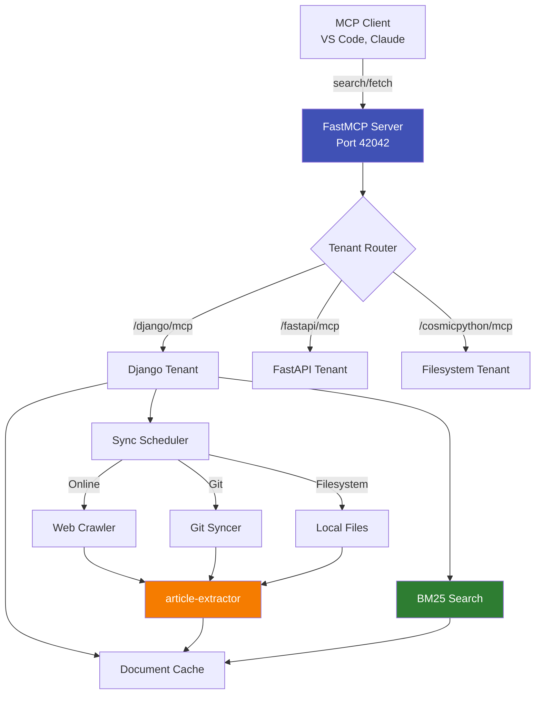

# docs-mcp-server

**Multi-tenant MCP server for your documentation**

Bring your own documentation sources - index once, search instantly through a unified MCP interface. Built with FastMCP, BM25 ranking, and article-extractor for clean content extraction.

---

## What is docs-mcp-server?

docs-mcp-server is a **Model Context Protocol (MCP) server** that lets AI assistants search and fetch documentation from multiple sources through a single, consistent API. Instead of manually searching websites or GitHub repos, your AI assistant can query documentation directly.

**Key Features:**

| Feature | Description |
|---------|-------------|
| **Multi-Tenant** | Serve unlimited doc sources from one container - add any docs you need |
| **Smart Search** | BM25 ranking with IDF floor, English preference, length normalization |
| **Auto-Sync** | Scheduled crawlers for online docs, git syncs for repositories |
| **MCP Native** | Standard MCP tools (search, fetch, browse) for seamless integration |
| **Offline-Ready** | Filesystem tenants for local markdown files |

---

## Quick Start (3 Commands)

```bash
# 1. Clone and install
git clone https://github.com/pankaj28843/docs-mcp-server.git
cd docs-mcp-server
uv sync

# 2. Test with Django docs
uv run python debug_multi_tenant.py --tenant django --test search

# 3. Deploy to Docker
uv run python deploy_multi_tenant.py --mode online
```

**Result**: MCP server running on `http://localhost:42042` with your configured documentation tenants.

---

## Architecture Overview



**Flow**:
1. MCP client (VS Code/Claude) sends search query to tenant endpoint
2. BM25 engine ranks cached documents
3. Results include title, URL, score, snippet
4. Fetch tool retrieves full document content
5. Sync scheduler updates docs in background

---

## Documentation Navigation

### 📚 Learning (Tutorials)

Start here if you're new to docs-mcp-server:

- [Getting Started](tutorials/getting-started.md) - Deploy your first tenant in 15 minutes
- [Adding Your First Tenant](tutorials/adding-first-tenant.md) - Configure a custom documentation source
- [Custom Search Configuration](tutorials/custom-search.md) - Tune BM25 parameters and test queries

### 🛠️ Tasks (How-To Guides)

Solve specific problems:

- [Configure Git Tenant](how-to/configure-git-tenant.md) - Add GitHub/GitLab repository docs
- [Configure Online Tenant](how-to/configure-online-tenant.md) - Add website documentation
- [Debug Crawlers](how-to/debug-crawlers.md) - Troubleshoot sync failures
- [Deploy to Docker](how-to/deploy-docker.md) - Production deployment
- [Trigger Syncs](how-to/trigger-syncs.md) - Force refresh documentation
- [Tune Search Ranking](how-to/tune-search.md) - Improve result quality

### 📖 Facts (Reference)

Look up specifications:

- [deployment.json Schema](reference/deployment-json-schema.md) - Complete configuration reference
- [CLI Commands](reference/cli-commands.md) - All scripts and their options
- [MCP Tools API](reference/mcp-tools.md) - Search, fetch, browse endpoints
- [Environment Variables](reference/environment-variables.md) - Runtime configuration
- [Python API](reference/python-api.md) - Internal modules for contributors

### 💡 Understanding (Explanations)

Learn why and how:

- [Architecture](explanations/architecture.md) - System design and patterns
- [Search Ranking (BM25)](explanations/search-ranking.md) - Why BM25 with IDF floor
- [Sync Strategies](explanations/sync-strategies.md) - Online vs Git vs Filesystem
- [Cosmic Python Patterns](explanations/cosmic-python.md) - DDD, Repository, Unit of Work

---

## Example Tenants (from deployment.example.json)

The example configuration includes 10 sample tenants to get you started:

**Python Ecosystem:**
`django`, `drf`, `fastapi`, `python`, `pytest`

**AI/Agents:**
`aws-bedrock-agentcore`, `strands-sdk`

**Architecture:**
`cosmicpython` (Cosmic Python patterns - free online)

**Git-based:**
`mkdocs`, `aidlc-rules`

> **Add your own**: Edit `deployment.json` to add any documentation source - websites, git repos, or local markdown files. See [Adding Your First Tenant](tutorials/adding-first-tenant.md) for a step-by-step guide.

**Configuration reference**: See [deployment.json Schema](reference/deployment-json-schema.md)

---

## Use Cases

### For AI Assistants (Claude Desktop, VS Code Copilot)

```json
// VS Code mcp.json
{
  "mcpServers": {
    "django-docs": {
      "url": "http://localhost:42042/django/mcp"
    },
    "fastapi-docs": {
      "url": "http://localhost:42042/fastapi/mcp"
    }
  }
}
```

**Workflow:**
1. Ask Claude: "How do I use Django ModelForm validation?"
2. Claude calls `mcp_techdocs_root_search(tenant="django", query="ModelForm validation")`
3. Gets ranked results with snippets
4. Fetches full content for top result
5. Answers with actual Django documentation quotes

### For Developers (Local Testing)

```bash
# Search Django docs
curl "http://localhost:42042/django/search?query=forms+validation" | jq .

# Fetch specific doc
curl -X POST "http://localhost:42042/django/fetch" \
  -H "Content-Type: application/json" \
  -d '{"url": "https://docs.djangoproject.com/en/5.1/topics/forms/"}'

# Check sync status
curl "http://localhost:42042/django/sync/status" | jq .
```

---

## Project Status

- ✅ **Production-Ready**: Battle-tested multi-tenant architecture
- ✅ **Actively Maintained**: Regular updates for new documentation sources
- ✅ **Test Coverage**: >90% on core search/sync logic
- ✅ **Docker Deployment**: One command to deploy all tenants

**Latest Release**: See [GitHub Releases](https://github.com/pankaj28843/docs-mcp-server/releases)

---

## Contributing

We welcome contributions! See [Contributing Guide](contributing.md) for:

- How to add new documentation tenants
- Development setup and testing
- Code style and architecture patterns
- Submitting pull requests

---

## License

MIT License - See [LICENSE](https://github.com/pankaj28843/docs-mcp-server/blob/main/LICENSE)

---

## Support

- **Issues**: [GitHub Issues](https://github.com/pankaj28843/docs-mcp-server/issues)
- **Discussions**: [GitHub Discussions](https://github.com/pankaj28843/docs-mcp-server/discussions)
- **Documentation**: [Read the full docs](https://pankaj28843.github.io/docs-mcp-server/)
