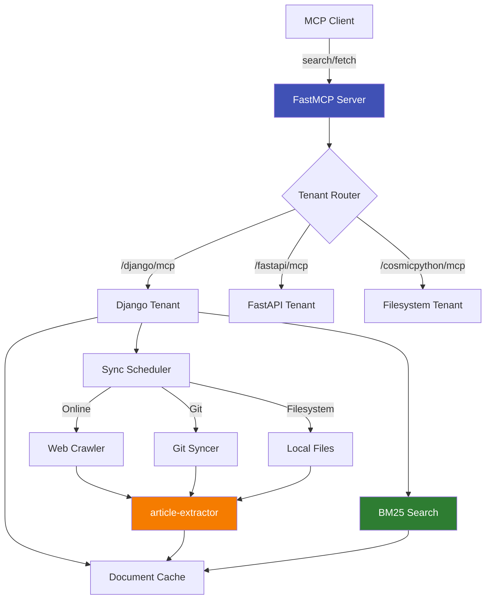

# docs-mcp-server

**Multi-tenant MCP server for your documentation**

## What is docs-mcp-server?

docs-mcp-server is a **Model Context Protocol (MCP) server** that gives AI assistants direct access to documentation.

**What it does:**

- Aggregates docs from websites, git repos, and local files
- Provides one consistent search API (MCP protocol)
- Auto-syncs content on schedule (no manual refresh)
- Returns relevant snippets + full documents

**Instead of:** Manually searching sites or asking AI to guess  
**You get:** AI assistant queries authoritative docs directly

**Why developers choose docs-mcp-server:**

| Priority | Feature | Benefit |
|----------|---------|----------|
| 🎯 **Core** | **Multi-Tenant** | One container serves unlimited doc sources |
| 🔍 **Core** | **BM25 Search** | Always-positive scores, works on 7-2500 docs |
| 🔄 **Core** | **Auto-Sync** | Scheduled crawls for websites, git pulls for repos |
| 🔌 **Integration** | **MCP Native** | Standard tools (search, fetch, browse) |
| ⚙️ **Ops** | **Docker-Ready** | Single command deploy, no complex setup |
| 📚 **Flexibility** | **Three Source Types** | Online, git, or filesystem docs |

---

## Quick Start (Fresh Clone)

Follow these steps in order:

### 1. Clone and Install

```bash
git clone https://github.com/pankaj28843/docs-mcp-server.git
cd docs-mcp-server
uv sync
```

### 2. Create Your Configuration

Copy the example configuration to create your own `deployment.json`:

```bash
cp deployment.example.json deployment.json
```

The example includes 10 pre-configured documentation tenants (Django, FastAPI, Python, etc.). You can use them as-is or edit `deployment.json` to customize.

### 3. Deploy to Docker

```bash
uv run python deploy_multi_tenant.py --mode online
```

This builds and starts the MCP server container on port 42042.

### 4. Trigger Initial Sync

After deployment, trigger a sync to crawl documentation. Start with a small tenant like `drf`:

```bash
uv run python trigger_all_syncs.py --tenants drf --force
```

**Wait 1-2 minutes** for the sync to complete. Check progress in container logs:

```bash
docker logs docs-mcp-server 2>&1 | grep -i drf | tail -5
```

### 5. Test Search

Once sync completes, verify search works:

```bash
uv run python debug_multi_tenant.py --host localhost --port 42042 --tenant drf --test search
```

### 6. Connect VS Code

Add the MCP server to your VS Code configuration (`~/.config/Code/User/mcp.json` on Linux, `~/Library/Application Support/Code/User/mcp.json` on macOS):

```json
{
  "servers": {
    "TechDocs": {
      "type": "http",
      "url": "http://127.0.0.1:42042/mcp"
    }
  }
}
```

Now your AI assistant (Copilot, Claude) can search all your configured documentation tenants!

!!! tip "Full Tutorial"
    See [Getting Started](tutorials/getting-started.md) for the complete walkthrough with detailed explanations.

---

## Example Tenants (from deployment.example.json)

The example configuration includes 10 sample tenants:

| Category | Tenants | Description |
|----------|---------|-------------|
| **Python** | `django`, `drf`, `fastapi`, `python`, `pytest` | Popular Python frameworks |
| **AI/Agents** | `aws-bedrock-agentcore`, `strands-sdk` | AI agent development |
| **Architecture** | `cosmicpython` | Cosmic Python patterns (free online) |
| **Git-based** | `mkdocs`, `aidlc-rules` | Documentation from GitHub repos |

!!! info "Customize Your Tenants"
    Edit `deployment.json` to add, remove, or modify tenants. See [Adding Your First Tenant](tutorials/adding-first-tenant.md).

---

## Architecture Overview



**Flow**:

1. MCP client (VS Code/Claude) sends search query to tenant endpoint
2. BM25 engine ranks cached documents
3. Results include title, URL, score, snippet
4. Fetch tool retrieves full document content
5. Sync scheduler updates docs in background

---

## Documentation Navigation

### 📚 Learning (Tutorials)

Start here if you're new to docs-mcp-server:

- [Getting Started](tutorials/getting-started.md) - Deploy your first tenant in 15 minutes
- [Adding Your First Tenant](tutorials/adding-first-tenant.md) - Configure a custom documentation source
- [Custom Search Configuration](tutorials/custom-search.md) - Tune BM25 parameters and test queries

### 🛠️ Tasks (How-To Guides)

Solve specific problems:

- [Configure Git Tenant](how-to/configure-git-tenant.md) - Add GitHub/GitLab repository docs
- [Configure Online Tenant](how-to/configure-online-tenant.md) - Add website documentation
- [Debug Crawlers](how-to/debug-crawlers.md) - Troubleshoot sync failures
- [Deploy to Docker](how-to/deploy-docker.md) - Production deployment
- [Trigger Syncs](how-to/trigger-syncs.md) - Force refresh documentation
- [Tune Search Ranking](how-to/tune-search.md) - Improve result quality

### 📖 Facts (Reference)

Look up specifications:

- [deployment.json Schema](reference/deployment-json-schema.md) - Complete configuration reference
- [CLI Commands](reference/cli-commands.md) - All scripts and their options
- [MCP Tools API](reference/mcp-tools.md) - Search, fetch, browse endpoints
- [Environment Variables](reference/environment-variables.md) - Runtime configuration
- [Python API](reference/python-api.md) - Internal modules for contributors

### 💡 Understanding (Explanations)

Learn why and how:

- [Architecture](explanations/architecture.md) - System design and patterns
- [Search Ranking (BM25)](explanations/search-ranking.md) - Why BM25 with IDF floor
- [Sync Strategies](explanations/sync-strategies.md) - Online vs Git vs Filesystem
- [Cosmic Python Patterns](explanations/cosmic-python.md) - DDD, Repository, Unit of Work

---

## Use Cases

### For AI Assistants (Claude Desktop, VS Code Copilot)

Add the MCP server to your VS Code configuration (`~/.config/Code/User/mcp.json` on Linux):

```json
{
  "servers": {
    "TechDocs": {
      "type": "http",
      "url": "http://127.0.0.1:42042/mcp"
    }
  }
}
```

**Workflow:**

1. Ask Claude: "How do I use Django ModelForm validation?"
2. Claude calls `mcp_techdocs_root_search(tenant="django", query="ModelForm validation")`
3. Gets ranked results with snippets
4. Fetches full content for top result
5. Answers with actual Django documentation quotes

### For Developers (Local Testing)

Test search and sync using the debug script:

```bash
# Run search test
uv run python debug_multi_tenant.py --host localhost --port 42042 --tenant drf --test search

# Run all tests (search, fetch, browse)
uv run python debug_multi_tenant.py --host localhost --port 42042 --tenant drf --test all
```

Check container health:

```bash
curl -s http://localhost:42042/health | jq '{status, tenant_count}'
```

---

## Project Status

- ✅ **Production-Ready**: Battle-tested multi-tenant architecture
- ✅ **Actively Maintained**: Regular updates for new documentation sources
- ✅ **Test Coverage Gate**: >=95% enforced via pytest-cov
- ✅ **Docker Deployment**: One command to deploy all tenants

**Latest Release**: See [GitHub Releases](https://github.com/pankaj28843/docs-mcp-server/releases)

---

## Contributing

We welcome contributions! See [Contributing Guide](contributing.md) for:

- How to add new documentation tenants
- Development setup and testing
- Code style and architecture patterns
- Submitting pull requests

---

## License

MIT License - See [LICENSE](https://github.com/pankaj28843/docs-mcp-server/blob/main/LICENSE)

---

## Support

- **Issues**: [GitHub Issues](https://github.com/pankaj28843/docs-mcp-server/issues)
- **Discussions**: [GitHub Discussions](https://github.com/pankaj28843/docs-mcp-server/discussions)
- **Documentation**: [Read the full docs](https://pankaj28843.github.io/docs-mcp-server/)
